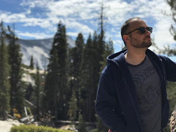

## Saman Farid
I am the founder of [Formic](www.formic.co) and am living in the San Francisco Bay area. We provide robotics to increase the productivity and capacity of factories across the US.

Prior to this, I ran the global investment fund for [Baidu Ventures](www.bv.ai) focusing on AI, Machine Learning, and it's effects on the way we work and live. I am also the founder of [Comet Labs](www.cometlabs.io) - an AI focused investment fund and incubator. Prior to working as an investor, I built and sold two technology companies.

Some of my past experiences are outlined on my [linkedin](https://www.linkedin.com/in/samanfarid/). I also am passionate about youth empowerment and work with [East Bay Lights](www.eastbaylights.us) when I am able.

You can write to me at \[myfullname] \[@] \[gmail.com] or find me on twitter [@samanfarid](https://twitter.com/samanfarid)

* [Formic blog](https://formic.co/resources)
* [blog](https://medium.com/@samanfarid)
* [BV blog](https://medium.com/baidu-ventures-blog)
* [investments](http://saman.co/2020/06/10/Investments.html)
* press/media

